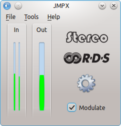

#JMPX v2
A Stereo encoder for FM transmitters now with RDS support.

This program can be used in conjunction with FM transmitters to produce stereo transmissions. This allows you to transmit your very own FM stereo signal which can be received with any standard FM stereo radio. The FM transmitter gets connected to the computer soundcard and JMPX takes care of the rest.

This program consists of a dynamically liked library and a GUI. The library performs the main work of obtaining audio and producing audio, and the GUI is just for control and looks. A soundcard that supports at least 96000Hz is needed for stereo operation and 192000Hz for RDS operation.

## Acknowledgments

Thanks to Radio Galileo (Galileo Soc. Coop.) 100.5Mhz in Terni Italy and Federico Allegretti for their funding to the development of RDS support for JMPX.

##Compiling

Qt and Qt Creator are recommended.

* Open [libJMPX/libJMPX.pro](libJMPX/libJMPX.pro) with Qt Creator and build
* Open [JMPX/JMPX.pro](JMPX/JMPX.pro) with Qt Creator and build
* Copy libJMPX.dll (or something like liblibJMPX.so.0.1 on Linux) from the build directory when building libJMPX to the build directory when building JMPX
* Run JMPX.exe (or JMPX on Linux)

##FM Transmitter

The transmitter needs to not have any low pass filter on its input from the soundcard. This is so the frequencies above 16kHz actually modulate the transmitter.

For testing it is posible to use a simple one transistor FM transmitter design but signal quality and frequency stablility are likly to be problems.

Jonti 2015
http://jontio.zapto.org
